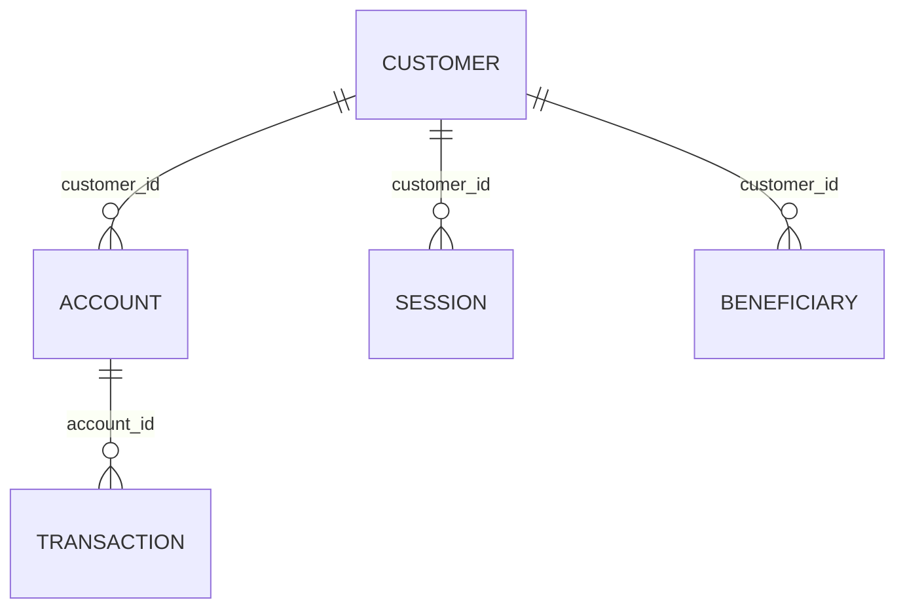

# spring-data-jdbc

- [Spring data JDBC Guide](https://spring.io/guides/gs/relational-data-access/)
- [Spring data Jdbc Reference](https://docs.spring.io/spring-data/jdbc/docs/current/reference/html/)
- [postgresql](https://www.postgresql.org/docs/current/).
- [Reference Repo to be follow](https://github.com/schauder/stackoverflow/tree/main/jdbc)
- [Aggregate Reference-1 ](https://thorben-janssen.com/spring-data-jdbc-aggregates/)
- [Aggregate Reference-2 ](https://thorben-janssen.com/spring-data-jdbc-custom-queries-and-projections/)

The entity fot his example looks like this :

